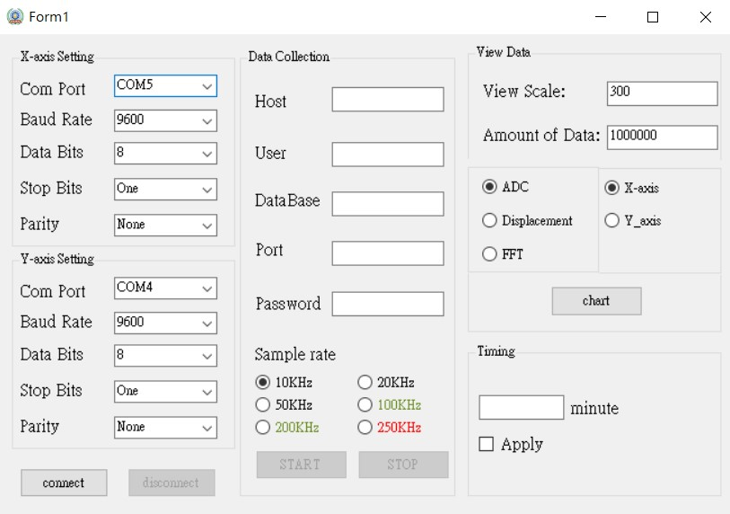

# High-Speed-Low-Cost-Transform-Module
This module can collect the analog signals and convert to the digital signals. After ADC, it can transfer the signals to PostgreSQL directly. In the UI, you can see the fastest sample rate is 250KHz, but if you use Ethernet or 5G, the fastest sample rate up to 600KHz

The image of User Interface
------

